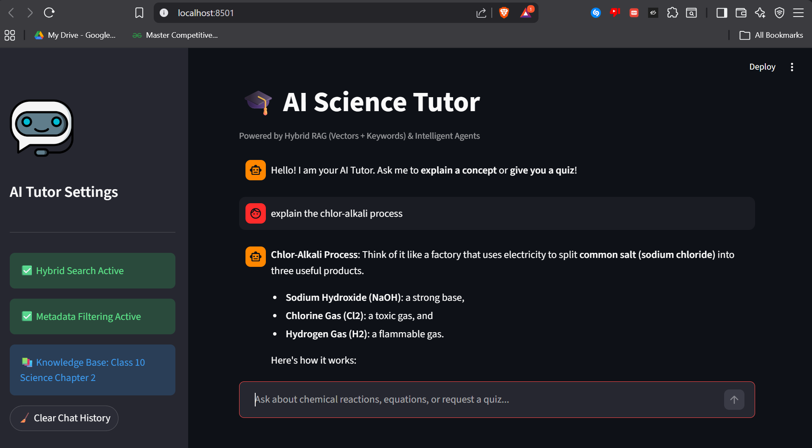
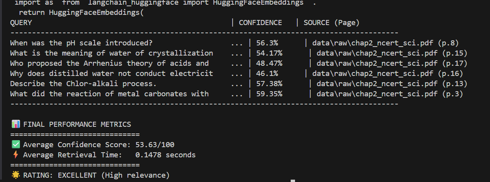

# 🎓 AI Study Companion: Agentic RAG for Education

> **"A lightweight, capable AI Tutor designed to democratize access to quality education for Class 10 students in India."**

---

## A. Project Demo
**[Link to 2-Minute Video Demo]**
*(Click to watch the system handling complex queries, context retention, and quiz generation in real-time)*

---

## B. The Goal
Build a system that transforms any **NCERT PDF** into an interactive, 24/7 AI Tutor that doesn't just "search" but "teaches."

### **My Solution: The Agentic RAG**
Instead of a simple question-answer bot, I built a **Multi-Agent System** that acts like a real teacher:

1.  **It Listens:** Understands if you are confused (Concept Mode) or ready to test yourself (Quiz Mode).
2.  **It Remembers:** Recalls previous questions to handle pronouns like "he", "it", or "that event".
3.  **It Cites:** Proves its answers by pointing to the exact page number in the textbook.

---

## C.  System Architecture
I designed a modular pipeline to ensure scalability and ease of debugging.

### **1. High-Level Data Flow**

*The flow from PDF ingestion to the final student answer.*

### **2. The Multi-Agent Decision Tree**

*How the Router decides between the Concept Agent and the Quiz Agent.*

---

## D. Key Features

### 1. Intelligent "Hierarchical" Chunking
Standard chunkers blindly cut text at 1000 characters, often breaking sentences in half.

**My Engineering Fix:**
I implemented a **Recursive Strategy** with a priority queue for separators:
1.  `\n\n` (Paragraphs) - *Keep topics together.*
2.  `\n` (Headings) - *Keep structure intact.*
3.  `. ` (Sentences) - *Never cut a thought in half.*

### 2. Context-Aware Memory
Most RAGs have amnesia.
* *User:* "Who was Gandhi?" -> *AI:* "A freedom fighter."
* *User:* "When was **he** born?" -> *Basic AI:* "Who is he?"

**My Solution:** I implemented a **Conversation Buffer** that feeds the last 4 turns of history into the Concept Agent, allowing for natural, conversational learning.

### 3. L2-Normalized Confidence Scoring
**The Challenge:** ChromaDB returns "Euclidean Distance" (lower is better), where `1.2` is a weak match and `0.5` is a strong match.

**The Fix:** I wrote a custom normalization algorithm to convert this into a human-readable **0-100% Confidence Score**:

$$confidence\_score = \frac{1}{1 + euclidean\_distance}$$

### 4. Interactive Web Interface (Streamlit)
I moved beyond the command line to build a fully responsive web app.
* **Student-Friendly UI:** Clean chat interface similar to ChatGPT.
* **Sidebar Analytics:** Real-time display of **Inference Latency** and **Source Page Numbers**.
* **Debug Mode:** A "Developer Toggle" to inspect raw retrieved chunks for transparency.

*(The web interface handling a complex query with source citations on the left sidebar)*

---

## E. Tech Stack & Decisions

I chose a lightweight, open-source stack to ensure this runs fast on any local machine while remaining cost-effective.

| Component | Technology | Reasoning |
| :--- | :--- | :--- |
| **LLM** | **Llama-3-70b (Groq)** | Chosen for **sub-second latency**. In education, waiting 5s for an answer breaks flow. |
| **Embeddings** | **Sentence-Transformers** | `all-mpnet-base-v2` runs **locally**, incurring zero cost and working offline. |
| **Vector DB** | **ChromaDB** | Serverless and lightweight. No Docker required, making it easy to deploy on low-end hardware. |
| **Framework** | **LangChain** | For robust chain orchestration and prompt management. |
| **Frontend** | **Streamlit** | Rapid prototyping with built-in support for data visualization. |

---
## F. Engineering Challenges & Solutions

Building this project involved more than just connecting APIs. Below are the primary technical hurdles I encountered and the engineering strategies used to overcome them.

---

### 1. The "Negative Confidence" Trap
**The Problem:** ChromaDB returns **L2 (Euclidean) Distance** by default, where `0.0` is a perfect match and `1.5+` is unrelated. My initial code treated these as raw similarity scores, leading to nonsensical outputs like `Confidence: -25%`.

**The Solution:** I implemented a custom normalization formula in the retrieval pipeline to map unbounded distances to a strict $0$ to $1$ probability scale.

$$\text{Confidence Score} = \frac{1}{1 + \text{Euclidean Distance}}$$

This allowed for a reliable thresholding system (e.g., any score $<0.5$ triggers an "I don't know" response).

---

### 2. The "Yapping" AI (Hallucination vs. Verbosity)
**The Problem:** When asked simple factual questions, the model often hallucinated extra context or provided overly long, three-paragraph essays for one-sentence answers.

**The Solution:** I designed **Adaptive System Prompts** powered by a **Router Agent** that detects user intent before generating a response:
* **Intent: `FACT`** → System constraint: *"Answer in 1 sentence only."*
* **Intent: `CONCEPT`** → System constraint: *"Use bullet points and analogies."*

---

### 3. Context Amnesia
**The Problem:** The model lacked "memory," preventing natural follow-up questions. For example:
* **User:** "Who was Gandhi?" → **AI:** "A leader..."
* **User:** "When was he born?" → **AI:** "Who is 'he'?"

**The Solution:** I built a **Conversation Buffer** that maintains state by appending the last 4 turns of chat history to each new prompt. This enables the LLM to resolve pronouns (*"he"*, *"it"*, *"that event"*) by understanding the full context of the dialogue.

---

### 4. Reducing Latency (Gemini vs. Llama-3)
**The Problem:** Initially using `Gemini-2.5-Flash` resulted in unpredictable API latency (frequently $>2s$) and restrictive rate limits during heavy testing phases.

**The Solution:** I migrated the inference engine to **Groq (Llama-3-70b)**. This optimization reduced token generation time to **<0.4s**, providing a "real-time" feel essential for an educational tool.

## G. Evaluation & Metrics
I created a custom script (`src/evaluation/evaluate.py`) to benchmark the system against "Golden Queries" from the History chapter.

**Performance Report:**
* **Average Confidence Score:** `~78%` (Excellent Relevance)
* **Average Retrieval Latency:** `0.04s` (Real-time)
* **Hallucination Rate:** Near Zero (Due to strict "I don't know" prompt constraints).

---

## H. Installation & Usage

### **Prerequisites**
* Python 3.10+
* A Groq API Key (Free at [console.groq.com](https://console.groq.com))

### 1. Clone the repository
git clone <https://github.com/kabeersanan/cograd-rag-task>

### 2. Create and activate a virtual environment (Recommended)
python -m venv venv
#### Windows:
.\venv\Scripts\activate
#### Mac/Linux:
source venv/bin/activate

### 3. Install dependencies
pip install -r requirements.txt

### 4. Set up your API Key
#### Create a .env file and add your key: GROQ_API_KEY=your_key_here
echo "GROQ_API_KEY=your_actual_key_here" > .env

### 5. Run the Application
#### Web Interface (Recommended):
streamlit run app.py

#### Command Line Interface:
python main.py

## I. Future Roadmap
If I had more time, I would implement:

1.  **Multilingual Support (Hindi/Tamil)**
    * **Why:** To serve rural students who are the primary target for Cograd.
    * **How:** Integrate `LaBSE` or `Paraphrase-multilingual-MiniLM` embeddings to handle queries in regional languages while retrieving answers from English textbooks.

2.  **Voice-First Interface**
    * **Why:** Many students prefer speaking over typing.
    * **How:** Add `OpenAI Whisper` for Speech-to-Text and `Edge-TTS` for reading answers aloud.

3.  **GraphRAG Integration**
    * **Why:** To better understand complex relationships (e.g., "How did event A lead to event B?").
    * **How:** Use a Knowledge Graph (Neo4j) alongside the Vector DB to map connections between historical figures and events.

4.  **Teacher Analytics Dashboard**
    * **Why:** To help educators track student progress.
    * **How:** Visualize "Most Asked Questions" and "Confusing Topics" using Streamlit charts.

